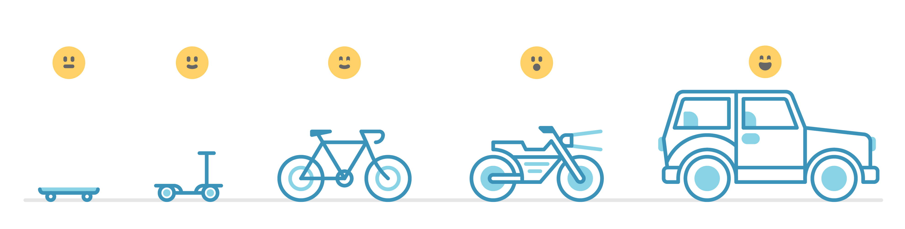

# Agile Development

> 
>
> - [Andrew Wilkinson](https://awilkinson.medium.com/skateboard-bike-car-6bec841ed96e)

_Agile Development_ is a methodology for developing software. In this
methodology you start with the simplest code you can possibly write to get
things started. This can even be just empty files with the right names in the
right folders! Then in small steps you add more code so that each little step
_works_, is meaningful for the user, and is a little closer to the end goal.

This strategy is sooooo important to learn because **programming is hard**. All
developers (even your coaches!) make mistakes all the time. The best way to
manage mistakes is to work in small, understandable steps and making sure that
each step works before moving on.

Working in small, meaningful steps is also important because it's impossible to
plan for everything. Your understanding of the problem will evolve, you will
learn better ways to write code, and the user's requirements will change over
time. Working in small meaningful steps and pausing to reassess after each step
makes it possible to adapt to changing requirements as you go.

Agile development is more about discipline than talent. Every minute you spend
practicing this now will save you hours of debugging and make collaboration a
natural part of your development process.

- [Learning Objectives](#learning-objectives): what you will learn from this
  module
- [Suggested Study](./suggested-study.md): Helpful links for this module, useful
  but not required.
- [Deliverables](./deliverables/README.md): Projects to practice applying the
  learning objectives in context
- [Lesson Plans](./lesson-plans/README.md): A few ideas for running lessons
  around this material.
- [Study Tips](#study-tips)
- [Setting Up](#setting-up)
- [Code Quality Scripts](#code-quality-scripts)

## Learning Objectives

Priorities: 🥚, 🐣, 🐥, 🐔 (click to learn more)

 

There is a lot to learn in this repository. If you can't master all the material
at once, that's expected! Anything you don't master now will always be waiting
for you to review when you need it. These 4 emoji's will help you prioritize
your study time and to measure your progress:

- 🥚: Understanding this material is required, it covers the base skills you'll
  need for this module and the next. You do not need to finish all of them but
  should feel comfortable that you could with enough time.
- 🐣: You have started all of these exercises and feel you could complete them
  all if you just had more time. It may not be easy for you but with effort you
  can make it through.
- 🐥: You have studied the examples and started some exercises if you had time.
  You should have a big-picture understanding of these concepts/skills, but may
  not be confident completing the exercises.
- 🐔: These concepts or skills are not necessary but are related to this module.
  If you are finished with 🥚, 🐣 and 🐥 you can use the 🐔 exercises to push
  yourself without getting distracted from the module's main objectives.

---

## [0. Developing HTML & CSS](./0-developing-html-and-css)

Practice with the skills, tools, and workflows you will need to efficiently
develop websites written with HTML & CSS.

- 🥚 **VSCode**: you can ...
  - [ ] use the _LiveServer extension_ to launch an HTML page in the browser
  - [ ] use autocomplete to begin a new HTML document, create new tags, and much
        more
  - [ ] use the _HTML CSS Support_ and _IntelliSense fo CSS class names_
        extensions to make writing HTML & CSS more efficient
- 🥚 **Formatting HTML & CSS**: You can ...
  - [ ] use VSCode configurations to format your code on save
  - [ ] use `npm run format` to format all the code in your repository
- [ ] 🥚 **Linting CSS**: You can use the `npm run lint:css` script to find
      mistakes in your CSS, and you can fix the mistakes.
- [ ] 🥚 **Validating HTML**: You can use the `npm run validate:html` script to
      find mistakes in your CSS, and you can fix the mistakes.
- 🥚 **Browser Developer Tools**: You can ...
  - [ ] inspect the source code of a web page using the Sources tab
  - [ ] find any part of the web page in the Elements tab of your Dev Tools DOM
        inspector
  - [ ] find the styles for any element in the Elements tab
  - [ ] make temporary changes in a web page from the Elements tab to see how
        they will look

## [1. Following Plans](./1-following-plans)

Practice working together in a group to build small websites in incremental
steps according to a plan. You will be given final code, a detailed plan to
rebuild it, and will need to work as a group following the processes in
[Planning and Collaborating](https://github.com/DeNepo/planning-and-collaborating).

- [ ] 🥚 **Project Definition and Scope**: As a group, you can agree on what you
      are trying to build, and can clearly describe the project using a README
      and a repository description.
- 🥚 **Project Constraints**: As a group you can define project constraints by
  discussing your strengths, weaknesses and context. You can set these types of
  constraints:
  - [ ] _External_: constraints that come from outside your group
  - [ ] _Internal, Involuntary_: constraints that come from within your group,
        but your group did not decide to have.
  - [ ] _Internal, Voluntary_: constraints your group decides on to improve the
        quality of your development process and final software.
- [ ] 🥚 **Communication Plans**: You can work with your group mates to agree on
      a communication plan to follow during development.
- [ ] 🥚 **Communicating Challenges**: During development you can discuss with
      your group when ...
  - you are blocked and need help the agreed channels of communication.
  - your schedule or availability changes
  - you are having trouble getting along with each other
- [ ] 🥚 **Using a Backlog**: You can develop from a backlog of features
      organized by priority:
  - _must-have_
  - _should-have_
  - _could-have_
- [ ] 🥚 **Follow a Development Strategies**: You can follow a development
      strategy to understand the code required for _must-have_ user stories.
- [ ] 🥚 **Create Issues From a Dev Strategy**: You can create issues for user
      stories in your project based on the development strategy.
- 🥚 **Retrospective**: Your group can complete a retrospective to ...
  - [ ] assess how well you worked as a group
  - [ ] find ways to improve in the next project
  - [ ] compare your plan to the reality of developing your website
- 🐣 **Claiming and Completing Issues**: You can claim issues from the _TODO_
  column of a project board and ...
  - [ ] track your progress with the project board
  - [ ] develop your code locally on a separate branch
  - [ ] send a PR that passes CI checks and meets the requirements
- [ ] 🐣 **Code Review**: You can both review a group mate's PR, and
      productively participate in a review of your own code.
- [ ] 🐣 **Match a Design & Acceptance Criteria**: When developing your tasks,
      you can write code that matches the project's Wireframe and meets your
      issue's Acceptance Criteria.

## [2. Writing Plans](./2-writing-plans)

Practicing writing your own plans as a group. You will be given _only_ the final
code for HTML/CSS web pages, your group will need write a detailed plan for
rebuilding the website in small steps.

- [ ] 🥚 **Write User Personas**: As a group you can describing your site's
      users with User Personas, and you can use the personas to plan your
      website from the user's perspective.
- [ ] 🥚 **Write User Stories**: Given a working web page, you can describe it
      with user stories and acceptance criteria for each user story.
- [ ] 🐣 **Write a Backlog**: After listing all the user stories for a web page,
      you can organize them into a Backlog by priority: _must-have_,
      _should-have_ and _could-have_
- [ ] 🐣 **Create a Prioritized Design**: Using your backlog and the original
      site as a guide, you can create a Wireframe of the site your group will
      build. You can use different colors and comments to indicate a priority
      for each component in the Wireframe.
- [ ] 🐣 **Write a Development Strategies**: You can translate your Wireframe
      and Backlog into a Development Strategy for the _must-have_ user stories.

## [3. Adapting Plans](./3-adapting-plans)

Even the best plans are not perfect, it's not possible to know everything ahead
of time! You may be able to plan everything ahead of time when the web pages you
build are very small and you have the code ahead of time, but it's a whole
different thing when you need to build a larger web page over a longer period of
time.

In this chapter you will practice full Agile Development by developing a larger,
open-ended web pages and adapting your plans as you go. Your team will need to
make an initial plan, but the plan will change! Practice having regular meetings
with your group to review the website's progress, review your plan, and make any
changes in the plan that are necessary to keep the project on schedule.

- [ ] 🐣 **Adjusting the Backlog**: As a group you can agree to changes in the
      backlog when necessary.
- [ ] 🐣 **Adjusting the Design**: As a group you can agree on changes to the
      design during the development process when it becomes clear your old
      design needs updating.
- [ ] 🐣 **Updating the Project Board**: You can manage the project board by
      adding, removing or updating issues when necessary. This includes changing
      labels, milestones, or assignees when necessary.

[TOP](#agile-development)

---

## Study Tips

expand/collapse

 

- Don't rush, understand! Programming is hard.
  - The examples and exercises will still be there to study later.
  - It's better to fail tests slowly and learn from your mistakes than to pass
    tests quickly and not understand why.
- Don't skip the examples! Understanding and experimenting with working code is
  a very effective way to learn programming.
- Write lots of comments in the examples and exercises. The code in this
  repository is yours to study, modify and re-use in projects.
- Practice
  [Pair Programming](https://home.hackyourfuture.be/students/study-tips/pair-programming):
  two people, one computer.
- Take a look through the
  [Learning From Code](https://home.hackyourfuture.be/students/study-tips/learning-from-code)
  guide for more study tips

### Study Board

Creating a project board on your GitHub account for tracking your study at HYF
can help you keep track of everything you're learning. You can create the board
at this link: `https://github.com/your_user_name?tab=projects`.

These 4 columns may be helpful:

- **todo**: material you have not studied yet
- **studying**: material you are currently studying
- **to review**: material you want to review again in the future
- **learned**: material you know well enough that you could help your classmates
  learn it

[TOP](#agile-development)

---

## Setting Up

> You will need
> [NPM](https://docs.npmjs.com/downloading-and-installing-node-js-and-npm)
> installed on your computer to study this material

1. Clone this repository:
   - using SSH:
     `git clone --depth 1 git@github.com:HackYourFutureBelgium/agile-development.git`
2. navigate to the cloned repository
   - `cd agile-development`
3. Install dependencies:
   - `npm install`

> It's highly recommended that you use either Linux or Mac. If you have a
> Windows computer you can either dual-boot your computer or install a virtual
> machine.

[TOP](#agile-development)

---

## Code Quality Scripts

expand/collapse

 

This repository comes with some scripts to check the quality of this code. You
can run these scripts to check the code provided by HYF, and to check the code
you write when experiment with the examples and complete the exercises.

### `npm run format`

This script will format all of the code in this repository making sure that all
the indentations are correct, the code is easy to read, and letting you know if
there are any syntax errors.

### `npm run format:check`

Checks the formatting of all files in the repository and throws an error if any
files are not well-formatted.

### `npm run spell-check`

This script will check all of the files in your repository for spelling
mistakes. Spelling is not just a detail, is important! Good spelling helps
others read and understand your programs with less effort.

`spell-check` is not so clever though, it doesn't have _all_ possible words in
it's dictionary and it won't know if you _wanted_ to spell a word incorrectly.
If you think one of it's "Unknown word"s is not a problem, you can either ignore
the suggestion or add the word to the `"words": [ ... ],` list in
[.cspell.json](./.cspell.json).

### `npm run lint:md`

This script will [lint](https://en.wikipedia.org/wiki/Lint_%28software%29) all
the Markdown files in this repository, checking for syntax mistakes and other
bad practices. Fixing linting errors will help you learn to write better code by
pointing out your mistakes _before_ they cause problems in your program.

Some linting errors will take some practice to understand and fix, but it will
be a good use of time.

### `npm run lint:ls` & `npm run lint:css`

This script will [lint](https://en.wikipedia.org/wiki/Lint_%28software%29) the
names of all files and folders in the project to check that they follow the
project naming convention
([kebab-case](https://betterprogramming.pub/string-case-styles-camel-pascal-snake-and-kebab-case-981407998841)).

### `npm run validate:html`

This script will
[validate](https://webplatform.github.io/docs/guides/html_validation/) the HTML
in this repository using
[html-validate](https://gitlab.com/html-validate/html-validate).

[TOP](#agile-development)
